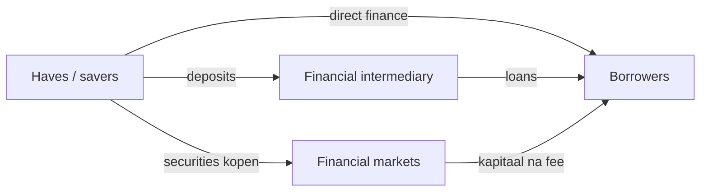

> **English variant** — This page is prepared for GitBook Variants. Financial key terms are kept close to the course terminology. Always verify formulas and official definitions with the Dutch/original course version.

# Unit 1 — The Financial System

!!! abstract "Core sentence"

    The financial system brengt geld van **haves** naar **havenots**: van partijen met overschotten naar partijen die financiering nodig hebben.

## 1. Actors: haves en havenots

**Haves** hebben kapitaal over en kunnen geld uitlenen of investeren. Exampleen zijn huishoudens, pensioenfondsen en beleggers. **Havenots** hebben meer plannen of behoeften dan geld en moeten kapitaal ophalen. Exampleen zijn bedrijven, overheden en huishoudens die een huis kopen.

Op macro-economisch niveau zijn **households** cruciaal. Zij zijn uiteindelijk de eigenaars van veel activa en dragen uiteindelijk ook veel risk. Zelfs als een bank of fonds tussenkomt, komt het geld vaak oorspronkelijk van gezinnen via deposits, pensioenbijdragen of beleggingen.

## 2. Household balance sheet

Een balance sheet toont links de **assets** en rechts de **liabilities** plus net wealth.

$$\text{Net wealth} = \text{assets} - \text{liabilities}$$

Example: een gezin heeft een huis van 100 en een hypotheekschuld van 80. De net wealth is 20.

| Assets | Liabilities |
|---|---|
| Real estate | Mortgage loan |
| Cars | Consumer loans |
| Stocks | Tax debt |
| Bonds |  |
| Mutual funds |  |
| Deposits en cash | Net wealth |

## 3. Soorten assets

Een **asset** is een bezit dat waarde heeft in een ruiltransactie.

- **Tangible/real assets**: fysieke activa zoals huizen, auto's, machines.
- **Intangible assets**: value through a legal right, bijvoorbeeld een patent.
- **Financial assets**: a claim on future cash flows, bijvoorbeeld shares, bonds of deposits.

!!! example "Example"

    Een share is geen fysiek bezit van een machine. Het is een financieel actief omdat het een eigendomsclaim is op een onderneming en mogelijk toekomstige dividenden geeft.

## 4. Asset classes

**Traditional asset classes** zijn common stock, bonds en cash/cash equivalents. **Alternative investments** zijn real estate, commodities, private equity, hedge funds, venture capital en currencies/forex.

Het verschil is belangrijk omdat elke asset class een ander risk-returnsprofiel heeft. Cash is meestal liquide en relatief veilig, terwijl private equity minder liquide en riskvoller is.

## 5. Growth drivers in net wealth

Net wealth verandert door:

1. waardeveranderingen van assets en liabilities;
2. netto-inkomen uit arbeid, kapitaal of transfers;
3. erfenissen en giften.

Als sharesmarkten stijgen, stijgt het vermogen van wie shares bezit. Bij een crash kan dat vermogen snel verdampen.

## 6. Corporates: equity, debt en leverage

Bedrijven financieren activa met **equity** en **debt**. Equity komt van sharehouders. Debt komt van leningen, bonds of trade credit.

**Leverage** betekent dat een bedrijf geleend geld gebruikt om meer activa te controleren. Dat kan ROE verhogen, maar ook verliezen versterken.

| Term | Meaning |
|---|---|
| ROA | return on assets = profit/assets |
| ROE | return on equity = profit/equity |
| Gearing | long-term debt / equity |
| Leverage multiplier | assets / equity |

Example: assets = 300, equity = 100, debt = 200. Gearing = 200/100 = 2. Leverage multiplier = 300/100 = 3.

## 7. Banken versus bedrijven

Een normale onderneming heeft vaak relatief meer equity. Een bank heeft typisch veel liabilities omdat deposits voor de bank schulden zijn. Wat voor jou een asset is, is voor de bank een liability.

!!! warning "Important voor exam"

    Een bankbalance sheet is kwetsbaar omdat banks veel leverage gebruiken en omdat deposits opvraagbaar zijn. Als veel klanten tegelijk geld willen, ontstaat liquidity risk of een bank run.

## 8. Direct, semi-direct en indirect finance

- **Direct finance**: geld gaat rechtstreeks van lender naar borrower.
- **Semi-direct finance**: markt of investment bank helpt bij uitgifte van securities en krijgt een fee.
- **Indirect finance**: financial intermediary staat ertussen, bijvoorbeeld een bank die deposits ontvangt en leningen geeft.

## 9. Rol van de overheid

De overheid reguleert omdat financial markets kunnen falen. Importante rollen:

- disclosure regulation: informatieplicht om fraude te vermijden;
- market conduct regulation: trading rules en insider trading bestrijden;
- financial institution regulation: banks en betalingssystemen veilig houden;
- monetary policy via centrale bank;
- bail-outs in crisissituaties.

## Exam focus

Je moet kunnen explain hoe geld van spaarders naar borrowers stroomt, hoe balance sheetstructuren verschillen en waarom banks door hun leverage en liquiditeitsfunctie speciaal supervision nodig hebben.

---

## Exam addendum — added without removing the existing documentation

!!! note "Non-destructive update"
    The original documentation above has deliberately been preserved. This addendum adds exam focus, extra terms, model answers and common mistakes without replacing the existing explanation.

!!! abstract "Core sentence"
    The financial system channels funds from haves to havenots through markets and intermediaries.

## What should you be able to do on the exam?

- Explain how households, firms, government, banks, funds and insurers are connected through balance sheets.
- Compare direct, semi-direct and indirect finance.
- Show why leverage can increase ROE but also risk.
- Link primary/secondary markets to issuance, trading, liquidity and repo.

## Core mechanism

For open questions, use this structure: **definition → mechanism → example → consequence/link with other units**. This shows that you know relationships, not just isolated terms.

## Formulas and calculation focus

- `Net wealth = assets - liabilities`
- `ROE = ROA × leverage multiplier`
- `Leverage multiplier = assets / equity`

!!! warning "Common mistakes"
    - Giving only a definition without linking it to markets or institutions.
    - Using a formula without stating the rate convention or time period.
    - Confusing payoff and profit for options.
    - Memorising ratings, index weights or order types without being able to apply them.

## Terms by unit

| Term | Dutch term | Definition | Exam relevance | Related to |
| --- | --- | --- | --- | --- |
| haves | haves | Economic units with a financing surplus that can lend funds. | Can be asked as a definition, comparison or application in Unit 1 — The Financial System. | households; lenders; financial system |
| havenots | havenots | Economic units with a financing deficit that need to raise funds. | Can be asked as a definition, comparison or application in Unit 1 — The Financial System. | borrowers; corporates; government |
| lenders | lenders | Savers or investors supplying funds. | Can be asked as a definition, comparison or application in Unit 1 — The Financial System. | haves; direct finance |
| borrowers | borrowers | Parties raising funds through loans, bonds or shares. | Can be asked as a definition, comparison or application in Unit 1 — The Financial System. | havenots; primary market |
| net wealth | net wealth | Wealth after liabilities: assets minus liabilities. | Can be asked as a definition, comparison or application in Unit 1 — The Financial System. | household balance sheet |
| balance sheet | balance sheet | Statement showing assets and liabilities/equity. | Can be asked as a definition, comparison or application in Unit 1 — The Financial System. | assets; liabilities |
| asset | asset | A possession that has value in an exchange transaction. | Can be asked as a definition, comparison or application in Unit 1 — The Financial System. | real assets; financial assets |
| real asset | real asset | Tangible asset deriving value from physical characteristics and utility. | Can be asked as a definition, comparison or application in Unit 1 — The Financial System. | real estate; commodities |
| intangible asset | intangible asset | Non-physical asset deriving value from a legal claim. | Can be asked as a definition, comparison or application in Unit 1 — The Financial System. | financial asset |
| financial asset | financial asset | Intangible asset representing a claim to future cash flows. | Can be asked as a definition, comparison or application in Unit 1 — The Financial System. | stocks; bonds |
| liability | liability | Debt or obligation on the balance sheet. | Can be asked as a definition, comparison or application in Unit 1 — The Financial System. | mortgage; consumer loan |
| equity | equity | Own funds; residual claim after debt. | Can be asked as a definition, comparison or application in Unit 1 — The Financial System. | shares; ROE |
| debt | debt | Borrowed funds with contractual repayment and interest. | Can be asked as a definition, comparison or application in Unit 1 — The Financial System. | bonds; loans |
| stock/share | stock/share | Ownership claim in a company and claim on dividends/residual value. | Can be asked as a definition, comparison or application in Unit 1 — The Financial System. | equity markets |
| bond | bond | Debt security requiring interest and principal payments. | Can be asked as a definition, comparison or application in Unit 1 — The Financial System. | bond markets |
| mutual fund | mutual fund | Collective investment portfolio issuing fund units/certificates. | Can be asked as a definition, comparison or application in Unit 1 — The Financial System. | intermediation |
| mortgage loan | mortgage loan | Loan secured by real estate. | Can be asked as a definition, comparison or application in Unit 1 — The Financial System. | household liabilities |
| consumer loan | consumer loan | Credit used to finance consumer spending over time. | Can be asked as a definition, comparison or application in Unit 1 — The Financial System. | household liabilities |
| traditional asset classes | traditional asset classes | Stocks, bonds and cash/cash equivalents. | Can be asked as a definition, comparison or application in Unit 1 — The Financial System. | asset allocation |
| alternative investments | alternative investments | Real estate, commodities, private equity, hedge funds, venture capital and currencies. | Can be asked as a definition, comparison or application in Unit 1 — The Financial System. | risk and return |
| leverage | leverage | Use of debt to increase return on equity, with extra risk. | Can be asked as a definition, comparison or application in Unit 1 — The Financial System. | gearing; ROE; ROA |
| gearing ratio | gearing ratio | Debt-to-equity measure, often long-term debt divided by equity. | Can be asked as a definition, comparison or application in Unit 1 — The Financial System. | Dupont; leverage |
| leverage multiplier | leverage multiplier | Assets divided by equity; in DuPont: ROE = ROA × LM. | Can be asked as a definition, comparison or application in Unit 1 — The Financial System. | ROE; ROA |
| direct finance | direct finance | Financing directly linking saver and borrower. | Can be asked as a definition, comparison or application in Unit 1 — The Financial System. | primary market |
| semi-direct finance | semi-direct finance | Direct financing assisted by an intermediary such as an investment bank for a fee. | Can be asked as a definition, comparison or application in Unit 1 — The Financial System. | issuance; arranger |
| indirect finance | indirect finance | Financing through the balance sheet of a financial institution, e.g. deposit to loan. | Can be asked as a definition, comparison or application in Unit 1 — The Financial System. | banking; intermediation |
| primary market | primary market | Market where new securities are issued for the first time. | Can be asked as a definition, comparison or application in Unit 1 — The Financial System. | issuance; auctions |
| secondary market | secondary market | Market where existing securities are traded. | Can be asked as a definition, comparison or application in Unit 1 — The Financial System. | liquidity; repo |
| money market | money market | Market for short-term instruments, typically up to one year. | Can be asked as a definition, comparison or application in Unit 1 — The Financial System. | T-bills; repo |
| capital market | capital market | Market for long-term funding such as equities and bonds. | Can be asked as a definition, comparison or application in Unit 1 — The Financial System. | equity; bonds |
| market failure | market failure | Situation where markets do not function efficiently or safely without intervention. | Can be asked as a definition, comparison or application in Unit 1 — The Financial System. | regulation |
| disclosure regulation | disclosure regulation | Rules forcing issuers to disclose relevant information. | Can be asked as a definition, comparison or application in Unit 1 — The Financial System. | investor protection |
| market conduct regulation | market conduct regulation | Rules governing fair market behaviour, trading and insider dealing. | Can be asked as a definition, comparison or application in Unit 1 — The Financial System. | supervision |
| systemically important financial institution | SIFI | Institution whose failure could damage the entire system. | Can be asked as a definition, comparison or application in Unit 1 — The Financial System. | bail-out; systemic risk |

## Sample questions with short model answers

??? question "Compare direct and indirect finance."
    **Short model answer:** Direct finance links saver and borrower directly through securities; indirect finance runs through an intermediary balance sheet, for example deposits transformed into bank loans.
??? question "Why are households crucial?"
    **Short model answer:** They are the ultimate owners of assets and ultimately bear risk in the system.

## Links with other units

- **Unit 1** provides the basic map: actors, markets, intermediaries and balance-sheet logic.
- **Units 2–4** provide valuation for money-market, bond and equity instruments.
- **Units 5–7** provide risk, portfolio and derivatives logic.
- **Units 9–12** explain banking, crisis, regulation and supervision.

!!! tip "Study tip"
    Learn each term actively: cover the definition, say an example out loud, then connect it to at least one other unit.
