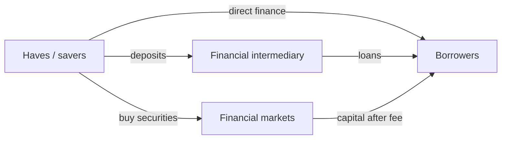

> **English variant** — Checked against the course slide pack, the exercise solutions and the Dutch summary. Key financial terms follow the terminology used in *Introduction to Financial Markets*.

# Unit 1 — The Financial System

!!! abstract "Key idea"

    The financial system channels funds from **haves** to **havenots**: from parties with financial surpluses to parties that need financing.

## 1. Actors: haves and havenots

**Haves** have surplus capital and can lend or invest money. Examples are households, pension funds and investors. **Havenots** have more plans or needs than available money and must raise capital. Examples are corporations, governments and households buying a house.

At the macroeconomic level, **households** are crucial. They are ultimately the owners of many assets and the ultimate bearers of many risks. Even if a bank or fund stands in between, the money often originates from households through deposits, pension contributions or investments.

## 2. Household balance sheet

A balance sheet shows **assets** on the left and **liabilities** plus net wealth on the right.

$$\text{Net wealth} = \text{assets} - \text{liabilities}$$

Example: a household owns a house worth 100 and has a remaining mortgage debt of 80. Net wealth is 20.

| Assets | Liabilities |
|---|---|
| Real estate | Mortgage loan |
| Cars | Consumer loans |
| Stocks | Tax debt |
| Bonds |  |
| Mutual funds |  |
| Deposits and cash | Net wealth |

## 3. Kinds of assets

An **asset** is a possession that has value in an exchange transaction.

- **Tangible/real assets**: physical assets such as houses, cars and machines.
- **Intangible assets**: assets whose value comes from a legal claim, for example a patent.
- **Financial assets**: claims to future cash flows, for example stocks, bonds or deposits.

!!! example "Example"

    A stock is not the physical ownership of a machine. It is a financial asset because it is an ownership claim on a company and may generate future dividends.

## 4. Asset classes

**Traditional asset classes** are common stock, bonds and cash/cash equivalents. **Alternative investments** include real estate, commodities, private equity, hedge funds, venture capital and currencies/forex.

This distinction matters because every asset class has a different risk-return profile. Cash is usually liquid and relatively safe, while private equity is less liquid and riskier.

## 5. Growth drivers in net wealth

Net wealth changes through:

1. changes in the value of assets and liabilities;
2. net income from labour, capital or transfers;
3. inheritances and gifts.

If stock markets rise, the wealth of stock owners rises. In a crash, that wealth can evaporate quickly.

## 6. Corporates: equity, debt and leverage

Corporations finance assets with **equity** and **debt**. Equity comes from shareholders. Debt comes from loans, bonds or trade credit.

**Leverage** means using borrowed money to control more assets. It can increase ROE, but it also magnifies losses.

| Term | Meaning |
|---|---|
| ROA | return on assets = profit/assets |
| ROE | return on equity = profit/equity |
| Gearing | long-term debt / equity |
| Leverage multiplier | assets / equity |

Example: assets = 300, equity = 100, debt = 200. Gearing = 200/100 = 2. Leverage multiplier = 300/100 = 3.

## 7. Banks versus corporations

A normal corporation often has relatively more equity. A bank typically has many liabilities because deposits are liabilities for the bank. What is an asset for you is a liability for the bank.

!!! warning "Important for the exam"

    A bank balance sheet is vulnerable because banks use a lot of leverage and because deposits can be withdrawn. If many customers want their money at the same time, liquidity risk or a bank run can arise.

## 8. Direct, semi-direct and indirect finance

- **Direct finance**: funds flow directly from lender to borrower.
- **Semi-direct finance**: a market or investment bank helps issue securities and receives a fee.
- **Indirect finance**: a financial intermediary stands in between, for example a bank that receives deposits and grants loans.

## 9. Role of the government

Government regulation exists because financial markets can fail. Important roles are:

- disclosure regulation: information duties to prevent fraud;
- market conduct regulation: trading rules and prevention of insider trading;
- financial institution regulation: keeping banks and payment systems safe;
- monetary policy through the central bank;
- bail-outs in crisis situations.

## Exam focus

You must be able to explain how money flows from savers to borrowers, how balance-sheet structures differ and why banks require special supervision because of their leverage and liquidity function.
