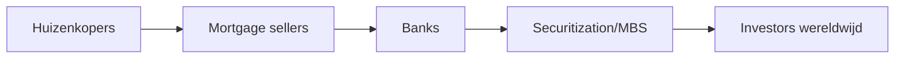

> **English variant** — This page is prepared for GitBook Variants. Financial key terms are kept close to the course terminology. Always verify formulas and official definitions with the Dutch/original course version.

# Unit 11 — The Financial Crisis of 2008

!!! abstract "Core sentence"

    De crisis van 2008 ontstond door een combinatie van goedkope kredieten, stijgende huizenprijzen, securitization, leverage, complexiteit, vertrouwenverlies en onderlinge verbondenheid.

## 1. Glass-Steagall

De Glass-Steagall Act van 1933 scheidde commercial banking en investment banking na de bankproblemen van de jaren 1930. De repeal in 1999 liet financiële groepen toe om retail en investment banking opnieuw te combineren via financial holding companies.

Critici stellen dat dit een firewall verwijderde en zo bijdroeg aan meer riskvolle combinaties in het financiële systeem.

## 2. Securitization en MBS

Hypotheken werden gebundeld en verkocht als mortgage-backed securities. Het basisidee is logisch: risk spreiden en financiering aantrekken. Het probleem ontstond toen de onderliggende hypotheken zwakker werden en beleggers onvoldoende begrepen wat in de pakketten zat.

## 3. Housing bubble

Huizen werden niet alleen gezien als shelter, maar ook als investering. Lage rente, makkelijke kredietverlening en de verwachting dat huizenprijzen altijd zouden stijgen, zorgden voor een bubble.

Toen huizenprijzen daalden, konden mensen niet herfinancieren en stegen defaults en foreclosures.

## 4. Importante spelers

| Speler | Rol |
|---|---|
| Fannie Mae | koopt/bundelt hypotheken, MBS, backbone hypotheekmarkt |
| Freddie Mac | vergelijkbaar, secundaire hypotheekmarkt |
| Bear Stearns | zwaar blootgesteld aan riskvolle MBS |
| Lehman Brothers | grote real estate exposure, failliet op 15 september 2008 |
| AIG | verzekeraar via o.a. bescherming op financiële posities, zeer interconnected |
| Fed/Treasury | crisismanagement en liquiditeitssteun |

## 5. Bear Stearns

Bear Stearns verloor vertrouwen door grote blootstelling aan riskvolle mortgage securities. Als een financiële instelling afhankelijk is van korte funding, kan vertrouwen snel verdwijnen. De overheid/Fed hielp een oplossing met JP Morgan om systeemschade te vermijden.

## 6. Fannie Mae en Freddie Mac

Deze instellingen waren essentieel voor de Amerikaanse hypotheekmarkt. De markt dacht dat er een impliciete overheidsgarantie was. Toen verliezen groot werden, moest de overheid ingrijpen omdat een default wereldwijde chaos kon veroorzaken.

## 7. Lehman Brothers

Lehman had grote real-estate-related exposure. Toen geen koper of redding kwam, moest Lehman faillissement aanvragen. Het faillissement deed het vertrouwen in de interbankmarkt instorten. Instellingen wilden elkaar geen geld meer lenen.

## 8. AIG

AIG was te sterk verbonden met investment banks. Als AIG was gevallen, konden ook andere grote instellingen zwaar geraakt worden. Daarom werd AIG gezien als too interconnected to fail.

## 9. TARP

TARP staat voor **Troubled Asset Relief Program**. Het doel was vertrouwen herstellen en kapitaal/liquiditeit in het banksysteem brengen. Politiek was dit moeilijk omdat burgers het zagen als Wall Street redden terwijl gewone gezinnen hun huis of pensioen verloren.

## 10. Van Wall Street naar Main Street

De crisis bleef niet beperkt tot banks. Als kredietmarkten opdrogen, kunnen bedrijven geen payroll of werkkapitaal meer financieren. Zo raakt een financiële crisis de reële economie: werkloosheid stijgt, consumptie daalt en productie vertraagt.

## Exam focus

Tell the crisis as a cause-and-effect chain: cheap mortgages → securitisation → risk spread through the system → house prices fell → defaults → losses → confidence collapsed → liquidity dried up → bail-outs/regulation.

---

## Exam addendum — added without removing the existing documentation

!!! note "Non-destructive update"
    The original documentation above has deliberately been preserved. This addendum adds exam focus, extra terms, model answers and common mistakes without replacing the existing explanation.

!!! abstract "Core sentence"
    The 2008 crisis connects leverage, securitisation, shadow banking, trust and government intervention.

## What should you be able to do on the exam?

- Explain securitisation from mortgages to MBS/CDO/ABS.
- Connect subprime and ratings to mispriced risk.
- Use the film Panic to discuss decisions and trade-offs.
- Explain systemic risk, contagion, too big to fail and bail-outs.

## Core mechanism

For open questions, use this structure: **definition → mechanism → example → consequence/link with other units**. This shows that you know relationships, not just isolated terms.

## Formulas and calculation focus

- No core formula; focus on conceptual relationships.

!!! warning "Common mistakes"
    - Giving only a definition without linking it to markets or institutions.
    - Using a formula without stating the rate convention or time period.
    - Confusing payoff and profit for options.
    - Memorising ratings, index weights or order types without being able to apply them.

## Terms by unit

| Term | Dutch term | Definition | Exam relevance | Related to |
| --- | --- | --- | --- | --- |
| financial crisis | financial crisis | Severe disruption of the financial system with credit, liquidity and confidence problems. | Can be asked as a definition, comparison or application in Unit 11 — The 2008 Financial Crisis. | systemic risk |
| subprime mortgage | subprime mortgage | Mortgage granted to a riskier borrower. | Can be asked as a definition, comparison or application in Unit 11 — The 2008 Financial Crisis. | 2008 crisis |
| securitisation | securitisation | Pooling assets and issuing securities backed by their cash flows. | Can be asked as a definition, comparison or application in Unit 11 — The 2008 Financial Crisis. | ABS |
| mortgage-backed security | MBS | Security backed by a pool of mortgages. | Can be asked as a definition, comparison or application in Unit 11 — The 2008 Financial Crisis. | securitisation |
| collateralised debt obligation | CDO | Structured product based on tranches of debt instruments. | Can be asked as a definition, comparison or application in Unit 11 — The 2008 Financial Crisis. | ratings |
| rating agency | rating agency | Institution assessing credit quality of securities/entities. | Can be asked as a definition, comparison or application in Unit 11 — The 2008 Financial Crisis. | investment grade |
| too big to fail | too big to fail | Institution so important that failure could damage the system. | Can be asked as a definition, comparison or application in Unit 11 — The 2008 Financial Crisis. | bail-out; SIFI |
| bail-out | bail-out | Government support to rescue a failing institution. | Can be asked as a definition, comparison or application in Unit 11 — The 2008 Financial Crisis. | moral hazard |
| systemic risk | systemic risk | Risk that problems spread through the financial system. | Can be asked as a definition, comparison or application in Unit 11 — The 2008 Financial Crisis. | contagion |
| contagion | contagion | Transmission of problems from one institution/market to others. | Can be asked as a definition, comparison or application in Unit 11 — The 2008 Financial Crisis. | interconnectedness |
| Panic: The Untold Story | Panic: The Untold Story | Film about decision-making during the 2008 financial crisis. | Can be asked as a definition, comparison or application in Unit 11 — The 2008 Financial Crisis. | crisis; regulation |
| Lehman Brothers | Lehman Brothers | Investment bank whose 2008 failure accelerated panic. | Can be asked as a definition, comparison or application in Unit 11 — The 2008 Financial Crisis. | systemic risk |

## Sample questions with short model answers

??? question "Why werd 2008 een systeemcrisis?"
    **Short model answer:** Door hoge leverage, onderlinge verbondenheid, onzekerheid over activa, runs en vertrouwen dat verdween.
??? question "Wat is het examendoel van Panic?"
    **Short model answer:** Niet filmfeiten memoriseren, maar crisismechanismen en beleidskeuzes kunnen uitleggen.

## Links with other units

- **Unit 1** provides the basic map: actors, markets, intermediaries and balance-sheet logic.
- **Units 2–4** provide valuation for money-market, bond and equity instruments.
- **Units 5–7** provide risk, portfolio and derivatives logic.
- **Units 9–12** explain banking, crisis, regulation and supervision.

!!! tip "Study tip"
    Learn each term actively: cover the definition, say an example out loud, then connect it to at least one other unit.
