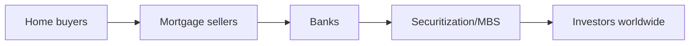

> **English variant** — Checked against the course slide pack, the exercise solutions and the Dutch summary. Key financial terms follow the terminology used in *Introduction to Financial Markets*.

# Unit 11 — The Financial Crisis of 2008

!!! abstract "Key idea"

    The 2008 crisis resulted from a combination of cheap credit, rising house prices, securitization, leverage, complexity, loss of confidence and interconnectedness.

## 1. Glass-Steagall

The Glass-Steagall Act of 1933 separated commercial banking from investment banking after the banking problems of the 1930s. Its repeal in 1999 allowed financial groups to combine retail and investment banking again through financial holding companies.

Critics argue that this removed a firewall and contributed to riskier combinations inside the financial system.

## 2. Securitization and MBS

Mortgages were pooled and sold as mortgage-backed securities. The basic idea is logical: spread risk and attract funding. The problem arose when the underlying mortgages became weaker and investors did not sufficiently understand what was inside the packages.

## 3. Housing bubble

Houses were not only seen as shelter, but also as an investment. Low interest rates, easy credit and the expectation that house prices would always rise created a bubble.

When house prices fell, people could no longer refinance and defaults and foreclosures increased.

## 4. Important players

| Player | Role |
|---|---|
| Fannie Mae | bought/pooled mortgages, MBS, backbone of the mortgage market |
| Freddie Mac | similar role in the secondary mortgage market |
| Bear Stearns | heavily exposed to risky MBS |
| Lehman Brothers | large real-estate exposure, bankrupt on 15 September 2008 |
| AIG | insurer, also protection on financial positions; highly interconnected |
| Fed/Treasury | crisis management and liquidity support |

## 5. Bear Stearns

Bear Stearns lost confidence because of large exposure to risky mortgage securities. If a financial institution depends on short-term funding, confidence can disappear very quickly. The government/Fed helped arrange a solution with JP Morgan to avoid systemic damage.

## 6. Fannie Mae and Freddie Mac

These institutions were essential to the US mortgage market. The market believed there was an implicit government guarantee. When losses became large, the government had to intervene because a default could have caused global chaos.

## 7. Lehman Brothers

Lehman had large real-estate-related exposure. When no buyer or rescue was found, Lehman had to file for bankruptcy. The bankruptcy destroyed confidence in the interbank market. Institutions no longer wanted to lend to each other.

## 8. AIG

AIG was very strongly connected to investment banks. If AIG had failed, other large institutions could have been severely affected. That is why AIG was considered **too interconnected to fail**.

## 9. TARP

TARP stands for **Troubled Asset Relief Program**. Its goal was to restore confidence and bring capital/liquidity into the banking system. Politically, this was difficult because citizens saw it as rescuing Wall Street while ordinary households lost homes or pension wealth.

## 10. From Wall Street to Main Street

The crisis did not remain limited to banks. If credit markets dry up, companies cannot finance payroll or working capital. That is how a financial crisis hits the real economy: unemployment rises, consumption falls and production slows.

## Exam focus

Tell the crisis as a cause-and-effect chain: cheap mortgages → securitization → risk is spread → house prices fall → defaults → losses → confidence collapses → liquidity dries up → bail-outs/regulation.
