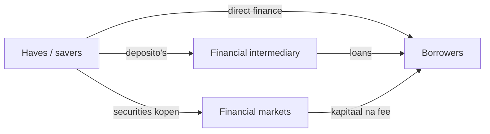

> **Nederlandse variant** — Dit is de hoofdversie voor het studeren. Gebruik de Engelse variant vooral om Engelse vaktermen te herkennen.

# Unit 1 — The Financial System

!!! abstract "Kernzin"

    Het financiële systeem brengt geld van **haves** naar **havenots**: van partijen met overschotten naar partijen die financiering nodig hebben.

## 1. Actors: haves en havenots

**Haves** hebben kapitaal over en kunnen geld uitlenen of investeren. Voorbeelden zijn huishoudens, pensioenfondsen en beleggers. **Havenots** hebben meer plannen of behoeften dan geld en moeten kapitaal ophalen. Voorbeelden zijn bedrijven, overheden en huishoudens die een huis kopen.

Op macro-economisch niveau zijn **households** cruciaal. Zij zijn uiteindelijk de eigenaars van veel activa en dragen uiteindelijk ook veel risico. Zelfs als een bank of fonds tussenkomt, komt het geld vaak oorspronkelijk van gezinnen via deposito's, pensioenbijdragen of beleggingen.

## 2. Household balance sheet

Een balans toont links de **assets** en rechts de **liabilities** plus net wealth.

$$\text{Net wealth} = \text{assets} - \text{liabilities}$$

Voorbeeld: een gezin heeft een huis van 100 en een hypotheekschuld van 80. De net wealth is 20.

| Assets | Liabilities |
|---|---|
| Real estate | Mortgage loan |
| Cars | Consumer loans |
| Stocks | Tax debt |
| Bonds |  |
| Mutual funds |  |
| Deposits en cash | Net wealth |

## 3. Soorten assets

Een **asset** is een bezit dat waarde heeft in een ruiltransactie.

- **Tangible/real assets**: fysieke activa zoals huizen, auto's, machines.
- **Intangible assets**: waarde door een juridisch recht, bijvoorbeeld een patent.
- **Financial assets**: een claim op toekomstige cashflows, bijvoorbeeld aandelen, obligaties of deposito's.

!!! example "Voorbeeld"

    Een aandeel is geen fysiek bezit van een machine. Het is een financieel actief omdat het een eigendomsclaim is op een onderneming en mogelijk toekomstige dividenden geeft.

## 4. Asset classes

**Traditional asset classes** zijn common stock, bonds en cash/cash equivalents. **Alternative investments** zijn real estate, commodities, private equity, hedge funds, venture capital en currencies/forex.

Het verschil is belangrijk omdat elke asset class een ander risico-rendementsprofiel heeft. Cash is meestal liquide en relatief veilig, terwijl private equity minder liquide en risicovoller is.

## 5. Growth drivers in net wealth

Net wealth verandert door:

1. waardeveranderingen van assets en liabilities;
2. netto-inkomen uit arbeid, kapitaal of transfers;
3. erfenissen en giften.

Als aandelenmarkten stijgen, stijgt het vermogen van wie aandelen bezit. Bij een crash kan dat vermogen snel verdampen.

## 6. Corporates: equity, debt en leverage

Bedrijven financieren activa met **equity** en **debt**. Equity komt van aandeelhouders. Debt komt van leningen, obligaties of trade credit.

**Leverage** betekent dat een bedrijf geleend geld gebruikt om meer activa te controleren. Dat kan ROE verhogen, maar ook verliezen versterken.

| Begrip | Betekenis |
|---|---|
| ROA | return on assets = profit/assets |
| ROE | return on equity = profit/equity |
| Gearing | long-term debt / equity |
| Leverage multiplier | assets / equity |

Voorbeeld: assets = 300, equity = 100, debt = 200. Gearing = 200/100 = 2. Leverage multiplier = 300/100 = 3.

## 7. Banken versus bedrijven

Een normale onderneming heeft vaak relatief meer equity. Een bank heeft typisch veel liabilities omdat deposito's voor de bank schulden zijn. Wat voor jou een asset is, is voor de bank een liability.

!!! warning "Belangrijk voor examen"

    Een bankbalans is kwetsbaar omdat banken veel leverage gebruiken en omdat deposito's opvraagbaar zijn. Als veel klanten tegelijk geld willen, ontstaat liquidity risk of een bank run.

## 8. Direct, semi-direct en indirect finance

- **Direct finance**: geld gaat rechtstreeks van lender naar borrower.
- **Semi-direct finance**: markt of investment bank helpt bij uitgifte van securities en krijgt een fee.
- **Indirect finance**: financiële intermediair staat ertussen, bijvoorbeeld een bank die deposito's ontvangt en leningen geeft.

## 9. Rol van de overheid

De overheid reguleert omdat financiële markten kunnen falen. Belangrijke rollen:

- disclosure regulation: informatieplicht om fraude te vermijden;
- market conduct regulation: trading rules en insider trading bestrijden;
- financial institution regulation: banken en betalingssystemen veilig houden;
- monetary policy via centrale bank;
- bail-outs in crisissituaties.

## Examenfocus

Je moet kunnen uitleggen hoe geld van spaarders naar borrowers stroomt, hoe balansstructuren verschillen en waarom banken door hun leverage en liquiditeitsfunctie speciaal toezicht nodig hebben.

---

## Examenaanvulling — toegevoegd zonder bestaande documentatie te verwijderen

!!! note "Niet-destructieve update"
    De oorspronkelijke documentatie hierboven is bewust behouden. Deze aanvulling voegt examenfocus, extra begrippen, modelantwoorden en veelgemaakte fouten toe zonder de bestaande uitleg te vervangen.

!!! abstract "Kernzin"
    Het financiële systeem verplaatst middelen van haves naar havenots via markten en intermediairs.

## Wat moet je kunnen op het examen?

- Leg uit hoe huishoudens, ondernemingen, overheid, banken, fondsen en verzekeraars via balansen verbonden zijn.
- Vergelijk direct, semi-direct en indirect finance.
- Toon waarom leverage ROE kan verhogen maar ook risico vergroot.
- Koppel primaire/secondaire markten aan uitgifte, handel, liquiditeit en repo.

## Kernmechanisme

Gebruik bij open vragen altijd deze structuur: **definitie → mechanisme → voorbeeld → gevolg/link met andere units**. Zo toon je dat je niet alleen losse woorden kent, maar ook relaties met financiële markten en instellingen.

## Formules en rekenfocus

- `Net wealth = assets - liabilities`
- `ROE = ROA × leverage multiplier`
- `Leverage multiplier = assets / equity`

!!! warning "Veelgemaakte fouten"
    - Alleen een definitie geven zonder relatie met markten of instellingen.
    - Een formule gebruiken zonder te zeggen welke renteconventie of periode gebruikt wordt.
    - Payoff en profit verwarren bij opties.
    - Ratings, indexgewichten of ordertypes uit het hoofd kennen maar niet kunnen toepassen.

## Begrippenlijst per unit

| Begrip | English term | Definitie | Examenbelang | Gelinkt aan |
| --- | --- | --- | --- | --- |
| haves | haves | Economische partijen met een financieringsoverschot die kapitaal kunnen uitlenen. | Kan als definitie, vergelijking of toepassing gevraagd worden in Unit 1 — Het financiële systeem. | households; lenders; financial system |
| havenots | havenots | Partijen met meer investerings- of consumptiebehoeften dan eigen middelen. | Kan als definitie, vergelijking of toepassing gevraagd worden in Unit 1 — Het financiële systeem. | borrowers; corporates; government |
| lenders | lenders | Spaarders of investeerders die geld beschikbaar stellen. | Kan als definitie, vergelijking of toepassing gevraagd worden in Unit 1 — Het financiële systeem. | haves; direct finance |
| borrowers | borrowers | Partijen die kapitaal ophalen via leningen, obligaties of aandelen. | Kan als definitie, vergelijking of toepassing gevraagd worden in Unit 1 — Het financiële systeem. | havenots; primary market |
| net wealth | net wealth | Vermogen na aftrek van schulden: assets min liabilities. | Kan als definitie, vergelijking of toepassing gevraagd worden in Unit 1 — Het financiële systeem. | household balance sheet |
| balance sheet | balance sheet | Overzicht van activa links en passiva/eigen vermogen rechts. | Kan als definitie, vergelijking of toepassing gevraagd worden in Unit 1 — Het financiële systeem. | assets; liabilities |
| asset | asset | Bezit met waarde in een ruiltransactie. | Kan als definitie, vergelijking of toepassing gevraagd worden in Unit 1 — Het financiële systeem. | real assets; financial assets |
| real asset | real asset | Materieel actief dat waarde haalt uit fysieke eigenschappen en nut. | Kan als definitie, vergelijking of toepassing gevraagd worden in Unit 1 — Het financiële systeem. | real estate; commodities |
| intangible asset | intangible asset | Niet-fysiek actief dat waarde haalt uit een juridische claim. | Kan als definitie, vergelijking of toepassing gevraagd worden in Unit 1 — Het financiële systeem. | financial asset |
| financial asset | financial asset | Immaterieel actief met claim op toekomstige cashflows. | Kan als definitie, vergelijking of toepassing gevraagd worden in Unit 1 — Het financiële systeem. | stocks; bonds |
| liability | liability | Schuld of verplichting op de balans. | Kan als definitie, vergelijking of toepassing gevraagd worden in Unit 1 — Het financiële systeem. | mortgage; consumer loan |
| equity | equity | Eigen vermogen; restclaim na schulden. | Kan als definitie, vergelijking of toepassing gevraagd worden in Unit 1 — Het financiële systeem. | shares; ROE |
| debt | debt | Vreemd vermogen met contractuele terugbetaling en rente. | Kan als definitie, vergelijking of toepassing gevraagd worden in Unit 1 — Het financiële systeem. | bonds; loans |
| stock/share | stock/share | Eigendomstitel in een onderneming en claim op dividend/restwaarde. | Kan als definitie, vergelijking of toepassing gevraagd worden in Unit 1 — Het financiële systeem. | equity markets |
| bond | bond | Schuldtitel waarbij de emittent rente en hoofdsom betaalt. | Kan als definitie, vergelijking of toepassing gevraagd worden in Unit 1 — Het financiële systeem. | bond markets |
| mutual fund | mutual fund | Collectieve beleggingsportefeuille met participaties/certificaten. | Kan als definitie, vergelijking of toepassing gevraagd worden in Unit 1 — Het financiële systeem. | intermediation |
| mortgage loan | mortgage loan | Lening gedekt door vastgoed. | Kan als definitie, vergelijking of toepassing gevraagd worden in Unit 1 — Het financiële systeem. | household liabilities |
| consumer loan | consumer loan | Krediet om consumptiegoederen over tijd te betalen. | Kan als definitie, vergelijking of toepassing gevraagd worden in Unit 1 — Het financiële systeem. | household liabilities |
| traditional asset classes | traditional asset classes | Aandelen, obligaties en cash/cash equivalents. | Kan als definitie, vergelijking of toepassing gevraagd worden in Unit 1 — Het financiële systeem. | asset allocation |
| alternative investments | alternative investments | Vastgoed, commodities, private equity, hedge funds, venture capital en valuta. | Kan als definitie, vergelijking of toepassing gevraagd worden in Unit 1 — Het financiële systeem. | risk and return |
| leverage | leverage | Gebruik van schuld om rendement op eigen vermogen te verhogen, met extra risico. | Kan als definitie, vergelijking of toepassing gevraagd worden in Unit 1 — Het financiële systeem. | gearing; ROE; ROA |
| gearing ratio | gearing ratio | Maatstaf voor schuld t.o.v. eigen vermogen, vaak long-term debt/equity. | Kan als definitie, vergelijking of toepassing gevraagd worden in Unit 1 — Het financiële systeem. | Dupont; leverage |
| leverage multiplier | leverage multiplier | Assets gedeeld door equity; in Dupont: ROE = ROA × LM. | Kan als definitie, vergelijking of toepassing gevraagd worden in Unit 1 — Het financiële systeem. | ROE; ROA |
| direct finance | direct finance | Financiering waarbij spaarder en ontlener rechtstreeks verbonden zijn. | Kan als definitie, vergelijking of toepassing gevraagd worden in Unit 1 — Het financiële systeem. | primary market |
| semi-direct finance | semi-direct finance | Directe financiering met tussenkomst van een helper zoals investment bank tegen fee. | Kan als definitie, vergelijking of toepassing gevraagd worden in Unit 1 — Het financiële systeem. | issuance; arranger |
| indirect finance | indirect finance | Financiering via balans van een financiële instelling, bv. bankdeposito naar banklening. | Kan als definitie, vergelijking of toepassing gevraagd worden in Unit 1 — Het financiële systeem. | banking; intermediation |
| primary market | primary market | Markt waar nieuwe effecten voor het eerst worden uitgegeven. | Kan als definitie, vergelijking of toepassing gevraagd worden in Unit 1 — Het financiële systeem. | issuance; auctions |
| secondary market | secondary market | Markt waar bestaande effecten verder verhandeld worden. | Kan als definitie, vergelijking of toepassing gevraagd worden in Unit 1 — Het financiële systeem. | liquidity; repo |
| money market | money market | Markt voor kortlopende instrumenten, typisch tot één jaar. | Kan als definitie, vergelijking of toepassing gevraagd worden in Unit 1 — Het financiële systeem. | T-bills; repo |
| capital market | capital market | Markt voor langlopende financiering zoals aandelen en obligaties. | Kan als definitie, vergelijking of toepassing gevraagd worden in Unit 1 — Het financiële systeem. | equity; bonds |
| market failure | market failure | Situatie waarin markten niet efficiënt of veilig functioneren zonder interventie. | Kan als definitie, vergelijking of toepassing gevraagd worden in Unit 1 — Het financiële systeem. | regulation |
| disclosure regulation | disclosure regulation | Regels die correcte informatieverstrekking door emittenten afdwingen. | Kan als definitie, vergelijking of toepassing gevraagd worden in Unit 1 — Het financiële systeem. | investor protection |
| market conduct regulation | market conduct regulation | Regels rond eerlijk marktgedrag, handel en insider trading. | Kan als definitie, vergelijking of toepassing gevraagd worden in Unit 1 — Het financiële systeem. | supervision |
| SIFI | systemically important financial institution | Instelling waarvan falen het hele systeem kan besmetten. | Kan als definitie, vergelijking of toepassing gevraagd worden in Unit 1 — Het financiële systeem. | bail-out; systemic risk |

## Voorbeeldvragen met korte modelantwoorden

??? question "Vergelijk direct en indirect finance."
    **Kort modelantwoord:** Direct finance linkt spaarder en ontlener rechtstreeks via effecten; indirect finance loopt via balans van een intermediair, bv. deposito naar banklening.
??? question "Waarom zijn huishoudens cruciaal?"
    **Kort modelantwoord:** Ze zijn ultieme eigenaars van activa en dragen uiteindelijk risico in het systeem.

## Link met andere units

- **Unit 1** levert het basisschema: actoren, markten, intermediairs en balanslogica.
- **Units 2–4** leveren waardering van geldmarkt-, obligatie- en aandeleninstrumenten.
- **Units 5–7** leveren risico, portfolio en derivaten.
- **Units 9–12** verklaren banking, crisis, regulation en supervision.

!!! tip "Studietip"
    Leer elk begrip actief: dek de definitie af, zeg hardop een voorbeeld, en leg daarna de link met minstens één andere unit.
