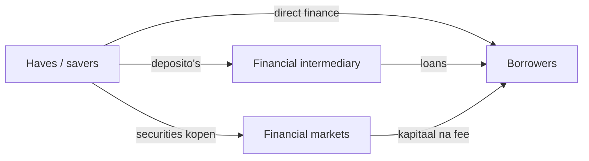

> **Nederlandse variant** — Dit is de hoofdversie voor het studeren. Gebruik de Engelse variant vooral om Engelse vaktermen te herkennen.

# Unit 1 — The Financial System

!!! abstract "Kernzin"

    Het financiële systeem brengt geld van **haves** naar **havenots**: van partijen met overschotten naar partijen die financiering nodig hebben.

## 1. Actors: haves en havenots

**Haves** hebben kapitaal over en kunnen geld uitlenen of investeren. Voorbeelden zijn huishoudens, pensioenfondsen en beleggers. **Havenots** hebben meer plannen of behoeften dan geld en moeten kapitaal ophalen. Voorbeelden zijn bedrijven, overheden en huishoudens die een huis kopen.

Op macro-economisch niveau zijn **households** cruciaal. Zij zijn uiteindelijk de eigenaars van veel activa en dragen uiteindelijk ook veel risico. Zelfs als een bank of fonds tussenkomt, komt het geld vaak oorspronkelijk van gezinnen via deposito's, pensioenbijdragen of beleggingen.

## 2. Household balance sheet

Een balans toont links de **assets** en rechts de **liabilities** plus net wealth.

$$\text{Net wealth} = \text{assets} - \text{liabilities}$$

Voorbeeld: een gezin heeft een huis van 100 en een hypotheekschuld van 80. De net wealth is 20.

| Assets | Liabilities |
|---|---|
| Real estate | Mortgage loan |
| Cars | Consumer loans |
| Stocks | Tax debt |
| Bonds |  |
| Mutual funds |  |
| Deposits en cash | Net wealth |

## 3. Soorten assets

Een **asset** is een bezit dat waarde heeft in een ruiltransactie.

- **Tangible/real assets**: fysieke activa zoals huizen, auto's, machines.
- **Intangible assets**: waarde door een juridisch recht, bijvoorbeeld een patent.
- **Financial assets**: een claim op toekomstige cashflows, bijvoorbeeld aandelen, obligaties of deposito's.

!!! example "Voorbeeld"

    Een aandeel is geen fysiek bezit van een machine. Het is een financieel actief omdat het een eigendomsclaim is op een onderneming en mogelijk toekomstige dividenden geeft.

## 4. Asset classes

**Traditional asset classes** zijn common stock, bonds en cash/cash equivalents. **Alternative investments** zijn real estate, commodities, private equity, hedge funds, venture capital en currencies/forex.

Het verschil is belangrijk omdat elke asset class een ander risico-rendementsprofiel heeft. Cash is meestal liquide en relatief veilig, terwijl private equity minder liquide en risicovoller is.

## 5. Growth drivers in net wealth

Net wealth verandert door:

1. waardeveranderingen van assets en liabilities;
2. netto-inkomen uit arbeid, kapitaal of transfers;
3. erfenissen en giften.

Als aandelenmarkten stijgen, stijgt het vermogen van wie aandelen bezit. Bij een crash kan dat vermogen snel verdampen.

## 6. Corporates: equity, debt en leverage

Bedrijven financieren activa met **equity** en **debt**. Equity komt van aandeelhouders. Debt komt van leningen, obligaties of trade credit.

**Leverage** betekent dat een bedrijf geleend geld gebruikt om meer activa te controleren. Dat kan ROE verhogen, maar ook verliezen versterken.

| Begrip | Betekenis |
|---|---|
| ROA | return on assets = profit/assets |
| ROE | return on equity = profit/equity |
| Gearing | long-term debt / equity |
| Leverage multiplier | assets / equity |

Voorbeeld: assets = 300, equity = 100, debt = 200. Gearing = 200/100 = 2. Leverage multiplier = 300/100 = 3.

## 7. Banken versus bedrijven

Een normale onderneming heeft vaak relatief meer equity. Een bank heeft typisch veel liabilities omdat deposito's voor de bank schulden zijn. Wat voor jou een asset is, is voor de bank een liability.

!!! warning "Belangrijk voor examen"

    Een bankbalans is kwetsbaar omdat banken veel leverage gebruiken en omdat deposito's opvraagbaar zijn. Als veel klanten tegelijk geld willen, ontstaat liquidity risk of een bank run.

## 8. Direct, semi-direct en indirect finance

- **Direct finance**: geld gaat rechtstreeks van lender naar borrower.
- **Semi-direct finance**: markt of investment bank helpt bij uitgifte van securities en krijgt een fee.
- **Indirect finance**: financiële intermediair staat ertussen, bijvoorbeeld een bank die deposito's ontvangt en leningen geeft.

## 9. Rol van de overheid

De overheid reguleert omdat financiële markten kunnen falen. Belangrijke rollen:

- disclosure regulation: informatieplicht om fraude te vermijden;
- market conduct regulation: trading rules en insider trading bestrijden;
- financial institution regulation: banken en betalingssystemen veilig houden;
- monetary policy via centrale bank;
- bail-outs in crisissituaties.

## Examenfocus

Je moet kunnen uitleggen hoe geld van spaarders naar borrowers stroomt, hoe balansstructuren verschillen en waarom banken door hun leverage en liquiditeitsfunctie speciaal toezicht nodig hebben.
