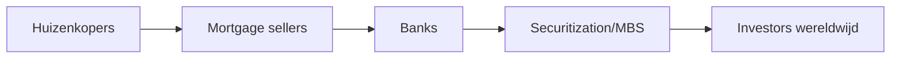

> **Nederlandse variant** — Dit is de hoofdversie voor het studeren. Gebruik de Engelse variant vooral om Engelse vaktermen te herkennen.

# Unit 11 — The Financial Crisis of 2008

!!! abstract "Kernzin"

    De crisis van 2008 ontstond door een combinatie van goedkope kredieten, stijgende huizenprijzen, securitization, leverage, complexiteit, vertrouwenverlies en onderlinge verbondenheid.

## 1. Glass-Steagall

De Glass-Steagall Act van 1933 scheidde commercial banking en investment banking na de bankproblemen van de jaren 1930. De repeal in 1999 liet financiële groepen toe om retail en investment banking opnieuw te combineren via financial holding companies.

Critici stellen dat dit een firewall verwijderde en zo bijdroeg aan meer risicovolle combinaties in het financiële systeem.

## 2. Securitization en MBS

Hypotheken werden gebundeld en verkocht als mortgage-backed securities. Het basisidee is logisch: risico spreiden en financiering aantrekken. Het probleem ontstond toen de onderliggende hypotheken zwakker werden en beleggers onvoldoende begrepen wat in de pakketten zat.

## 3. Housing bubble

Huizen werden niet alleen gezien als shelter, maar ook als investering. Lage rente, makkelijke kredietverlening en de verwachting dat huizenprijzen altijd zouden stijgen, zorgden voor een bubble.

Toen huizenprijzen daalden, konden mensen niet herfinancieren en stegen defaults en foreclosures.

## 4. Belangrijke spelers

| Speler | Rol |
|---|---|
| Fannie Mae | koopt/bundelt hypotheken, MBS, backbone hypotheekmarkt |
| Freddie Mac | vergelijkbaar, secundaire hypotheekmarkt |
| Bear Stearns | zwaar blootgesteld aan risicovolle MBS |
| Lehman Brothers | grote real estate exposure, failliet op 15 september 2008 |
| AIG | verzekeraar via o.a. bescherming op financiële posities, zeer interconnected |
| Fed/Treasury | crisismanagement en liquiditeitssteun |

## 5. Bear Stearns

Bear Stearns verloor vertrouwen door grote blootstelling aan risicovolle mortgage securities. Als een financiële instelling afhankelijk is van korte funding, kan vertrouwen snel verdwijnen. De overheid/Fed hielp een oplossing met JP Morgan om systeemschade te vermijden.

## 6. Fannie Mae en Freddie Mac

Deze instellingen waren essentieel voor de Amerikaanse hypotheekmarkt. De markt dacht dat er een impliciete overheidsgarantie was. Toen verliezen groot werden, moest de overheid ingrijpen omdat een default wereldwijde chaos kon veroorzaken.

## 7. Lehman Brothers

Lehman had grote real-estate-related exposure. Toen geen koper of redding kwam, moest Lehman faillissement aanvragen. Het faillissement deed het vertrouwen in de interbankmarkt instorten. Instellingen wilden elkaar geen geld meer lenen.

## 8. AIG

AIG was te sterk verbonden met investment banks. Als AIG was gevallen, konden ook andere grote instellingen zwaar geraakt worden. Daarom werd AIG gezien als too interconnected to fail.

## 9. TARP

TARP staat voor **Troubled Asset Relief Program**. Het doel was vertrouwen herstellen en kapitaal/liquiditeit in het banksysteem brengen. Politiek was dit moeilijk omdat burgers het zagen als Wall Street redden terwijl gewone gezinnen hun huis of pensioen verloren.

## 10. Van Wall Street naar Main Street

De crisis bleef niet beperkt tot banken. Als kredietmarkten opdrogen, kunnen bedrijven geen payroll of werkkapitaal meer financieren. Zo raakt een financiële crisis de reële economie: werkloosheid stijgt, consumptie daalt en productie vertraagt.

## Examenfocus

Vertel de crisis als oorzaak-gevolgketen: goedkope hypotheken → securitization → risico verspreid → huizenprijzen dalen → defaults → verliezen → vertrouwen valt weg → liquiditeit droogt op → bail-outs/regulering.

---

## Examenaanvulling — toegevoegd zonder bestaande documentatie te verwijderen

!!! note "Niet-destructieve update"
    De oorspronkelijke documentatie hierboven is bewust behouden. Deze aanvulling voegt examenfocus, extra begrippen, modelantwoorden en veelgemaakte fouten toe zonder de bestaande uitleg te vervangen.

!!! abstract "Kernzin"
    De crisis van 2008 verbindt leverage, securitisation, shadow banking, vertrouwen en overheidstussenkomst.

## Wat moet je kunnen op het examen?

- Leg securitisatie uit van hypotheken naar MBS/CDO/ABS.
- Koppel subprime en ratings aan verkeerde risico-inschatting.
- Gebruik de film Panic om beslissingen en trade-offs te bespreken.
- Verklaar systemic risk, contagion, too big to fail en bail-outs.

## Kernmechanisme

Gebruik bij open vragen altijd deze structuur: **definitie → mechanisme → voorbeeld → gevolg/link met andere units**. Zo toon je dat je niet alleen losse woorden kent, maar ook relaties met financiële markten en instellingen.

## Formules en rekenfocus

- Geen kernformule; focus op conceptuele verbanden.

!!! warning "Veelgemaakte fouten"
    - Alleen een definitie geven zonder relatie met markten of instellingen.
    - Een formule gebruiken zonder te zeggen welke renteconventie of periode gebruikt wordt.
    - Payoff en profit verwarren bij opties.
    - Ratings, indexgewichten of ordertypes uit het hoofd kennen maar niet kunnen toepassen.

## Begrippenlijst per unit

| Begrip | English term | Definitie | Examenbelang | Gelinkt aan |
| --- | --- | --- | --- | --- |
| financial crisis | financial crisis | Ernstige verstoring in financiële systeem met krediet-, liquiditeits- en vertrouwensproblemen. | Kan als definitie, vergelijking of toepassing gevraagd worden in Unit 11 — Financial Crisis 2008. | systemic risk |
| subprime mortgage | subprime mortgage | Hypotheek aan risicovollere kredietnemer. | Kan als definitie, vergelijking of toepassing gevraagd worden in Unit 11 — Financial Crisis 2008. | 2008 crisis |
| securitisation | securitisation | Bundelen van activa en uitgeven van effecten op die cashflows. | Kan als definitie, vergelijking of toepassing gevraagd worden in Unit 11 — Financial Crisis 2008. | ABS |
| MBS | mortgage-backed security | Effect gedekt door hypotheekpool. | Kan als definitie, vergelijking of toepassing gevraagd worden in Unit 11 — Financial Crisis 2008. | securitisation |
| CDO | collateralised debt obligation | Gestructureerd product gebaseerd op tranches van schuldinstrumenten. | Kan als definitie, vergelijking of toepassing gevraagd worden in Unit 11 — Financial Crisis 2008. | ratings |
| rating agency | rating agency | Instelling die kredietkwaliteit van effecten/entiteiten beoordeelt. | Kan als definitie, vergelijking of toepassing gevraagd worden in Unit 11 — Financial Crisis 2008. | investment grade |
| too big to fail | too big to fail | Instelling is zo belangrijk dat faillissement systeemschade kan veroorzaken. | Kan als definitie, vergelijking of toepassing gevraagd worden in Unit 11 — Financial Crisis 2008. | bail-out; SIFI |
| bail-out | bail-out | Overheidssteun om falende instelling te redden. | Kan als definitie, vergelijking of toepassing gevraagd worden in Unit 11 — Financial Crisis 2008. | moral hazard |
| systemic risk | systemic risk | Risico dat problemen zich door het hele financiële systeem verspreiden. | Kan als definitie, vergelijking of toepassing gevraagd worden in Unit 11 — Financial Crisis 2008. | contagion |
| contagion | contagion | Besmetting van problemen van één instelling/markt naar andere. | Kan als definitie, vergelijking of toepassing gevraagd worden in Unit 11 — Financial Crisis 2008. | interconnectedness |
| Panic: The Untold Story | Panic: The Untold Story | Film over besluitvorming tijdens de financiële crisis van 2008. | Kan als definitie, vergelijking of toepassing gevraagd worden in Unit 11 — Financial Crisis 2008. | crisis; regulation |
| Lehman Brothers | Lehman Brothers | Investeringsbank waarvan faillissement in 2008 paniek versnelde. | Kan als definitie, vergelijking of toepassing gevraagd worden in Unit 11 — Financial Crisis 2008. | systemic risk |

## Voorbeeldvragen met korte modelantwoorden

??? question "Waarom werd 2008 een systeemcrisis?"
    **Kort modelantwoord:** Door hoge leverage, onderlinge verbondenheid, onzekerheid over activa, runs en vertrouwen dat verdween.
??? question "Wat is het examendoel van Panic?"
    **Kort modelantwoord:** Niet filmfeiten memoriseren, maar crisismechanismen en beleidskeuzes kunnen uitleggen.

## Link met andere units

- **Unit 1** levert het basisschema: actoren, markten, intermediairs en balanslogica.
- **Units 2–4** leveren waardering van geldmarkt-, obligatie- en aandeleninstrumenten.
- **Units 5–7** leveren risico, portfolio en derivaten.
- **Units 9–12** verklaren banking, crisis, regulation en supervision.

!!! tip "Studietip"
    Leer elk begrip actief: dek de definitie af, zeg hardop een voorbeeld, en leg daarna de link met minstens één andere unit.
